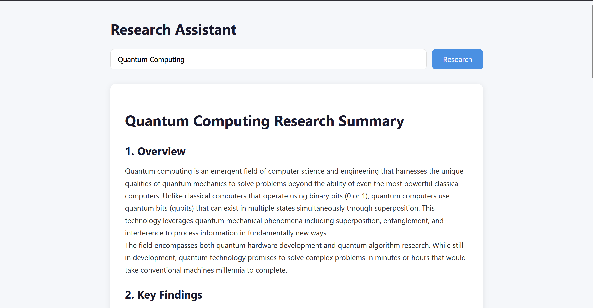

# AI Research Assistant

A learning project to explore core AI agent concepts — tool use, 
ReAct loops, and LLM orchestration — by building a full-stack 
research assistant that autonomously searches the web and 
synthesises structured summaries.

## Demo



## How It Works

The agent follows a ReAct (Reasoning + Acting) loop:
```
User Topic → Agent → Search Web → Fetch Page Content → Synthesise → Structured Summary
```

1. The user enters a research topic in the React frontend
2. A POST request is sent to the FastAPI backend
3. The LangChain agent autonomously decides which tools to use
4. It searches the web via DuckDuckGo and fetches relevant page content
5. The LLM synthesises the findings into a structured summary with sources
6. The React frontend renders the markdown response with clickable sources

## Tech Stack

- **Frontend** — React, TypeScript
- **Backend** — FastAPI (async), Python
- **Agent Framework** — LangChain (`create_agent`)
- **LLM & Tools** — Ollama (local/cloud models)
- **Search** — DuckDuckGo (free, no API key required)

## Key Technical Decisions

**`create_agent` API** — Used LangChain's modern `create_agent` 
which handles the ReAct loop internally, significantly reducing 
boilerplate compared to manually managing `AgentExecutor` chains.

**Tool separation** — Search and page fetching are kept as separate 
tools, giving the agent flexibility to decide when to search vs 
when to read a full page — rather than combining them into one 
rigid pipeline.

**Async FastAPI** — The research endpoint is async to avoid blocking 
the server during long-running agent calls (typically 15–30 seconds).

**Source parsing via prompt engineering** — Rather than parsing 
arbitrary LLM output, the system prompt instructs the agent to 
format sources as `[text](url)` markdown links, making extraction 
consistent and reliable with a simple regex.

## Setup

**Prerequisites:** Install Ollama from https://ollama.com

1. Clone the repository
```
git clone https://github.com/NafeelNuhuman/research-assistant.git
cd research-assistant
```

2. Start Ollama
```
ollama signin
ollama serve
```

3. Start the backend
```
cd Backend
python -m venv venv
venv\Scripts\activate
pip install -r requirements.txt
python main.py
```

4. Start the frontend
```
cd Frontend
npm install
npm start
```

5. Open http://localhost:3000 in your browser

> **Note:** Three terminals need to be running simultaneously —
> Ollama, the FastAPI backend, and the React frontend.
> The default model is `qwen3.5:397b-cloud` which requires 
> an Ollama account (`ollama signin`).

## Project Structure
```
research-assistant/
├── Backend/
│   ├── agent.py        # LangChain agent, tools, ReAct loop
│   ├── main.py         # FastAPI endpoints and response parsing
│   └── config.py       # Model names, iteration limits, port
├── Frontend/
│   └── src/
│       └── App.tsx     # React UI, state management, API calls
└── README.md
```